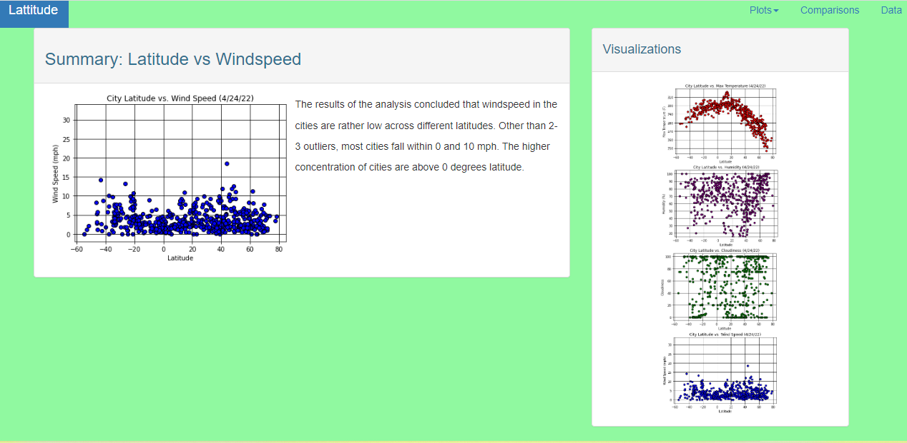
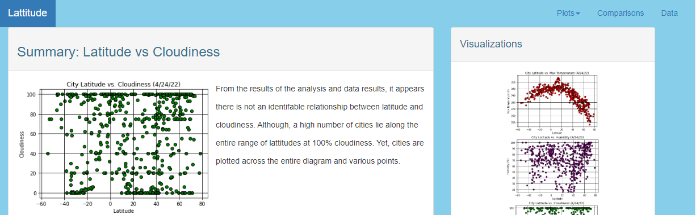

# WebDesign
For this project, a website was created using visualizations that were developed in a Python-APIs analysis using the provided cities.csv.

In building the dashboard, create individual pages for each plot and a way to navigate between them. These pages contain the visualizations. There is also a landing page to provide a comparison of all the plots, along with another page to present the data used to build them.

### Website Requirements

The website must consist of seven pages in total, including:

* Containing the following elements:

  * An explanation of the project

  * Links to each visualizations page with a sidebar containing preview images of each plot. Clicking an image takes the user to that visualization.

* Four pages
 
 
 
 
 

 * A descriptive title and heading tag.

  * The plot or visualization for the selected comparison (latitude vs: max temperature, humidity, cloudiness, or wind speed). 

  * A paragraph describing the plot and its significance.
 
  
 

* A ["Comparisons" page](#comparisons-page) that does the following:

  * Contains all of the visualizations on the same page so they can easily be compared with each other.

  * Uses a Bootstrap grid for the visualizations.

    * The grid must be two visualizations across medium and large screens, and it must be one visualization across on extra-small or small screens.

* A ["Data" page](#data-page) that displays a responsive table containing the data used in the visualizations.

  * The table must be a Bootstrap table component. 

  * The data must come from exporting the `.csv` file as HTML or by converting it to HTML. 

At the top of every page, the website must have a navigation menu with the following elements:

* Name of the site on the left of the navigation bar to return to the landing page from any page.

* Dropdown menu on the right of the navigation bar, named "Plots," to provide links to each individual visualization page.

* Text links on the right: "Comparisons," which links to the comparisons page, and "Data," which links to the data page.

* Be responsive (using media queries). 

### Considerations

* Use Bootstrap and include
* Bootstrap `navbar` component for the header on every page, 
* Bootstrap table component for the data page, 
* Bootstrap grid for responsiveness on the comparison page.
* Bootstrap and/or `@media` for the navigation bar.

* Website works at all window widths or sizes.

### Screenshots

This section contains screenshots of each page that must be built, at varying screen widths. 

#### Landing page

Large screen:

Small screen:



#### Comparisons page

Large screen:

Small screen:

#### Data page

Large screen:

Small screen:

#### Visualization pages

You'll build four of these, one for each visualization. Here's an example of one visualization page on two different screen sizes:

Large screen:

Small screen:

#### Navigation menu

Large screen:

Small screen:

